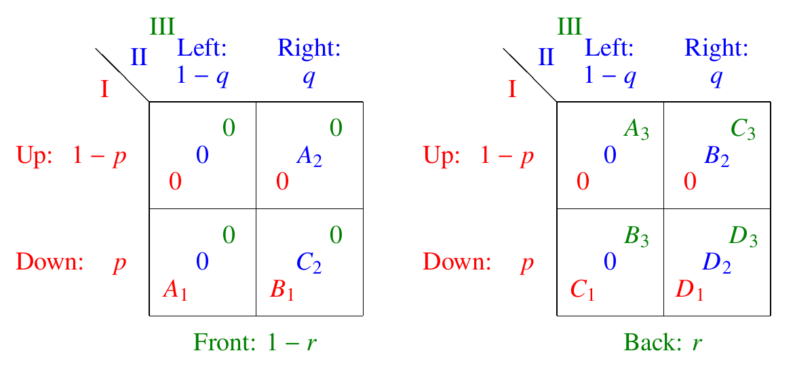

# Automated Equilibrium Enumeration and 3D Representation of 2x2x2 Games

This Python application computes **all equilibria** of **2×2×2 strategic-form non-cooperative games** and generates a **3D visualisation** of the best response surfaces. It follows the symmetric representation and algorithms explained in the paper linked below.

## 📌 Description

Using the methods presented in our paper, this tool allows users to input a 2×2×2 game, automatically computes all equilibria, and renders an interactive 3D plot of all best response surfaces for deeper game-theoretic analysis.


## 🎮 Input Formats

Our formulation of 2×2×2 games is symmetric across players, using a cyclical clockwise order of players: 1 → 2 → 3. For example, for player 1, the next player is player 2 and the previous player is player 3. 

We denote the mixed strategy parameters of players 1, 2, and 3 as:

- `x₁ = p`,  
- `x₂ = q`,  
- `x₃ = r`.

Following the cyclical order, we define `x₀ = r` and `x₄ = p` to handle indexing smoothly.

We support several representations of 2×2×2 games, and input can be provided in any of the following formats for players' payoffs:

###  Normalized Form



In the normalized form, the payoff matrix is simplified by subtracting the payoff of the first strategy from both strategies for each player, keeping the opponent's strategies fixed. As a result, the expected payoff of the first strategy is always zero. This transformation does **not** change the best responses of the players but significantly simplifies the analysis.

Under this representation, for each player $i \in \{1,2,3\}$, the player's payoff is specified using four scalar values `[Aᵢ, Bᵢ, Cᵢ, Dᵢ]`, corresponding to the values in the matrix format above.

The expected payoff function `Sᵢ(xᵢ₊₁, xᵢ₋₁)` for player $i$ can then be computed as:


$$
S_i(x_{i+1},x_{i-1}) = (1-x_{i+1}) (1-x_{i-1}) A_i + x_{i+1} (1-x_{i-1}) B_i + (1-x_{i+1}) x_{i-1} C_i + x_{i+1} x_{i-1} D_i
$$

### Hyperbolic Form 

The expected payoff function from the normalized form can be rewritten by defining new parameters as follows:

$$
S_i(x_{i+1}, x_{i-1}) = M_i \, x_{i+1} x_{i-1} + K_i \, x_{i+1} + L_i \, x_{i-1} + A_i
$$

where

$$
M_i = A_i - B_i - C_i + D_i, \quad K_i = B_i - A_i,  \quad L_i = C_i - A_i
$$

So in the hyperbolic form, for each player $i \in \{1, 2, 3\}$, the player's payoff is specified using four scalar values `[Mᵢ, Kᵢ, Lᵢ, Aᵢ]`.


### Product Form 

If $M_i \neq 0$, the expected payoff functions from the hyperbolic form can be rewritten in product form as follows:

\begin{align}
		S_1(q,r)=& \quad(q - q_1) &\times \quad & (r - r_2)\quad -& K_1&\\
		S_2(r,p)=& \quad(r - r_1) &\times \quad & (p - p_2)\quad -& K_2&\\
		S_3(p,q)=& \quad(p - p_1) &\times \quad & (q - q_2)\quad -& K_3&\\
\end{align}

Therefore, in the product form, all players' payoffs can be represented together by ``[p₁, q₂, K₁]``, ``[r₁, p₂, K₂]``, ``[q₁, r₂, K₃]``.

## 🚀 How to Run

The code is implemented in **Python 3** and requires the packages `numpy` and `matplotlib` to be installed.

You can run the main script with:

```bash
python RUN.py
```
with the following as command arguments. 

Alternatively, if the code is run without arguments, a description of the options below will be shown, and arguments can be given interactively in active mode.

### 🎮 Input Options
| Option | Description | Parameters Example |
|--------|-------------|--------------------|
| `-n`   | Normalised form | `-n [A₁,B₁,C₁,D₁] [A₂,B₂,C₂,D₂] [A₃,B₃,C₃,D₃]` |
| `-k`   | Hyperbolic form | `-k [M₁,K₁,L₁,A₁] [M₂,K₂,L₂,A₂] [M₃,K₃,L₃,A₃]` |
| `-r`   | Product form | `-r [p₁, q₂, K₁] [r₁, p₂, K₂] [q₁, r₂, K₃]` |
| `-t`   | Run from predefined test cases where `testID ∈ [0, ..., 43]` | `-t testID` |
| `-f`   | Read from file with `.stf` format (default: `game.stf`) | `-f inputfile` |

### 📤 Output Options

| Option | Description | Parameters Example |
|--------|-------------|--------------------|
| `-v`   | Verbose mode (default:`1 = print`, `0 = silent`) | `-v 0` |
| `-o`   | Orientation (default:`1 = horizontal`, `0 = vertical`) | `-o 0` |
| `-w`   | Write text output to file (default: `out.txt`) | `-w my_output` |
| `-p`   | Show plot (default:`1 = show`, `0 = don't show`) | `-p 0` |
| `-s`   | Save plot (default:`0 = no`, `1 = yes`) | `-s 1 figure` |
| `-g`   | Rotate plot and save animation as GIF (default:`0 = no`, `1 = yes`) | `-g 1 outputname` |
| `-b`   | Plot best response of one player only (`1`, `2`, or `3`) | `-b 2` |
| `-q`   | Quit the program | `-q` |

### 🧪 Example

Run predefined test number `10`, save the plot as an image named `test10.png`, rotate the plot to see different angles and save it as an animated GIF `rotation10.gif`, and suppress text output.

```bash
python RUN.py -t 10 -s 1 test10 -g 1 rotation10 -v 0
```
---
## 📄 Citation & Paper

This project is part of the research presented in the paper:

**"Automated Equilibrium Analysis of 2×2×2 Games"**  
📄 [Link to paper](https://dl.acm.org/doi/10.1007/978-3-031-15714-1_13)

## 👤 Author

**Sahar Jahani**  
PhD in Mathematics – London School of Economics

